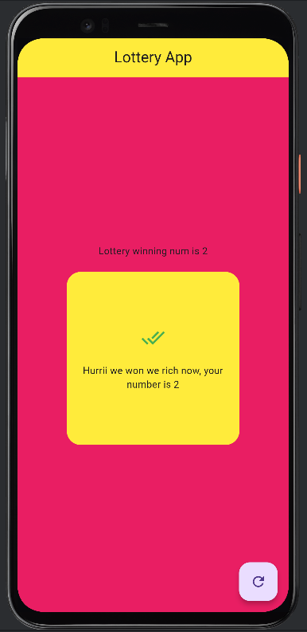

#  Lottery App

A simple and fun Flutter app that randomly generates a number and checks whether it matches the winning lottery number. If it does — congratulations, you're "rich"! If not, try again by pressing the refresh button!

---

##  Screenshots

| Winning | Losing |
|--------|--------|
|  |  |

---

##  Project Structure
    ```bash
    lib/
└── main.dart            # Main logic and UI
assets/
└── screenshots/         # App screenshots for README

---

##  Features

- 🎲 Generates a random number (0–4)  
- 🏆 Win if your number is `2`  
- 🎨 Colorful, engaging UI  
- 🔁 Tap refresh to try again  
- 💬 Dynamic messages for win/los

##  Getting Started

To run this project locally:

1. **Clone the repository**
   ```bash
   git clone https://github.com/your-username/lottery-app.git
   cd lottery-app
2. **Install dependencies**
   ```bash
   flutter pub get
3. **Run the app**
   ```bash
   flutter run

---

##  Contributions

Contributions to Learnify are welcome! If you encounter any issues or have suggestions for improvement, you can fork the repository, make your changes, and submit a pull request.

