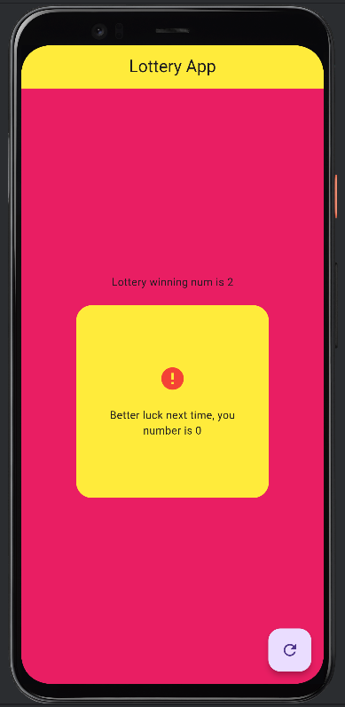

# 🎰 Lottery App

A simple and fun Flutter app that randomly generates a number and checks whether it matches the winning lottery number. If it does — congratulations, you're "rich"! If not, try again by pressing the refresh button!

---

## 🛠️ Features

- Random number generation (0 to 4)
- Checks if your number matches the winning number
- Simple and colorful UI using `Material Design`
- Instant refresh with a Floating Action Button
- Conditional display message based on result

---

## 📱 Screenshots

| Winning | Losing |
|--------|--------|
|  |  |

> _Add screenshots of your app UI in an `assets/screenshots/` folder and update the image paths above accordingly._

---

## 🚀 Getting Started

To run this project locally:

1. **Clone the repository**
   ```bash
   git clone https://github.com/your-username/lottery-app.git
   cd lottery-app

